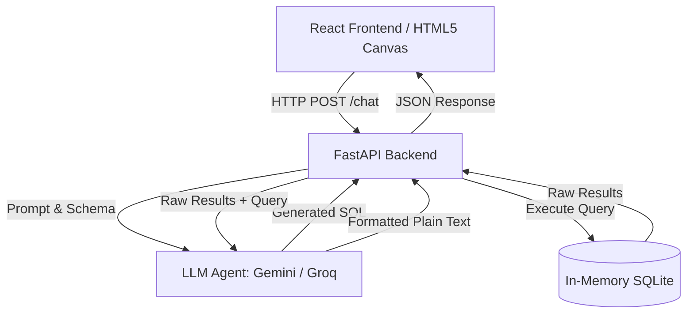
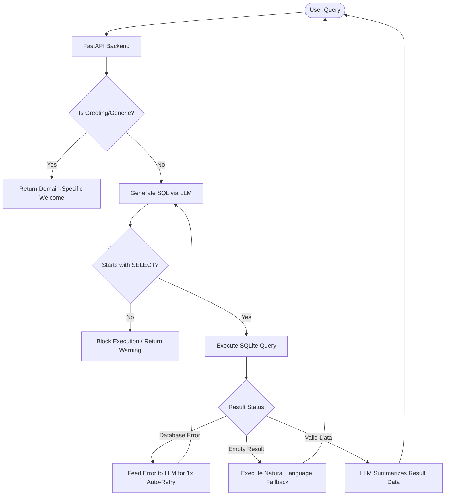

# Dodge AI — Context Graph System

Dodge AI is an intelligent, agent-based Graph Visualization tool designed to navigate and interpret complex Order-to-Cash (O2C) datasets. Through conversational AI, users can ask natural language questions ("Which products have the most billing documents?") and instantly receive both plain-English insights and a fully interactive visualization mapping out the backend relationships.

This system combines a rich **React** frontend for visualization, a **FastAPI** backend for highly-concurrent routing, **SQLite** for lightning-fast relational queries, and an agentic **LLM integration** to intelligently generate and execute SQL.

---

## 🏗 System Architecture

The project utilizes a Unified Full-Stack Architecture. The FastAPI backend serves both the dynamic API endpoints (`/chat`, `/graph`) and the compiled static frontend files (`frontend/dist/`), ensuring a seamless, single-footprint deployment.



1. **React + HTML5 Canvas (`react-force-graph-2d`):** Chosen for rendering up to 1000+ nodes and edges smoothly using WebGL/Canvas forces, gracefully avoiding DOM overhead.
2. **FastAPI:** Python's leading asynchronous framework. Ideal for orchestrating data parsing, Pandas manipulation, and LLM network requests concurrently without blocking.

---

## 🗄 Database Strategy

**Choice:** Local file-based SQLite.

While graph databases (e.g., Neo4j) are typically used for visualization layers, they carry significant overhead and complexity for structured business data. For an O2C tabular dataset encompassing strict relationships (Customers → Orders → Shipments → Invoices → Payments), **SQLite** provides distinct advantages:

1. **Zero Configuration Ingestion:** Data is instantly ingested from raw `.jsonl` dumps into structured relational tables using robust `pandas.to_sql` processing.
2. **Deterministic Querying for Agents:** Large Language Models excel at generating standard SQL with `JOIN` operations. A structured SQLite schema ensures exactly correct counts and aggregations over broken business flows (e.g., using `LEFT JOIN` to locate orders without payments), which is harder to guarantee with Cypher or typical graph query languages.
3. **Immutability & Safety:** The database acts as a read-only source of truth queried on the fly.

---

## 🧠 LLM Prompting Strategy

Our agent generates highly accurate SQL despite the complexity of real-world SAP schema tables by employing a **Constrained Context Injection Strategy**:

1. **Dynamic Schema Injection:** The SQLite table schemas (`PRAGMA table_info`) are loaded dynamically and injected directly into the system prompt on startup.
2. **Explicit Join Path Constraints:** O2C tables require specific mapping dependencies. Our prompt explicitly instructs the LLM with `CRITICAL JOIN PATHS` (e.g., *Never join billing items directly to sales orders — always route through outbound_delivery_items*).
3. **Verified Few-Shot Examples:** By providing 3-4 highly complex, verified target queries in the prompt (e.g., tracing a full document flow), the LLM learns the topology and reliably pattern-matches.
4. **Data Summarization Chain:** A two-step process: First, the LLM generates SQL. The Database runs the query. Then, a second contextual LLM prompt formats the raw JSON result into conversational, non-technical plain text.

---

## 🛡 System Guardrails & Fallback Logic

To ensure safety, reliability, and scope constraints during business usage, the system implements a strict funnel for all queries.



1. **Read-Only Constraint Checks:** The Python execution engine strictly parses the generated SQL to validate it begins with `SELECT` and outright blocks any destructive keywords (`DROP`, `DELETE`, `INSERT`, `UPDATE`).
2. **Off-Topic Detection:** The core instructions mandate the model output a strict fallback string (`GUARDRAIL: off-topic`) if queried outside the O2C domain. The backend intercepts this flag and returns a polite redirect.
3. **Conversational Shortcuts:** Simple generic inputs ("hi", "hello", "help") bypass the LLM entirely, responding instantly with domain-specific suggested queries to save compute and improve UX.
4. **Execution Retries:** If the generated SQL throws an SQLite syntax error, an automated inner loop feeds the exact trace back to the LLM to auto-correct its join structure.

---

## 🚀 Working Demo & Deployment

Deploying the service requires combining both frontend and backend into a single Web Service. 

**Local Run Instructions (No Authentication Required):**
1. Clone the repository locally.
2. In the `backend` directory, add your API Key to a `.env` file (`GROQ_API_KEY=...` or `GEMINI_API_KEY=...`).
3. Build the frontend static files: 
   ```bash
   cd frontend
   npm install
   npm run build
   ```
4. Start the backend orchestration:
   ```bash
   cd backend
   pip install -r requirements.txt
   uvicorn main:app --port 8000
   ```
5. Visit `http://localhost:8000` to interact with the UI.

*(For public deployments on platforms like Render, simply declare a Web Service using the Python 3 environment, set the build script to install Node dependencies, run `npm run build`, and execute `uvicorn main:app` via Python. FastAPI will automatically route root traffic to the `dist/` index).*
